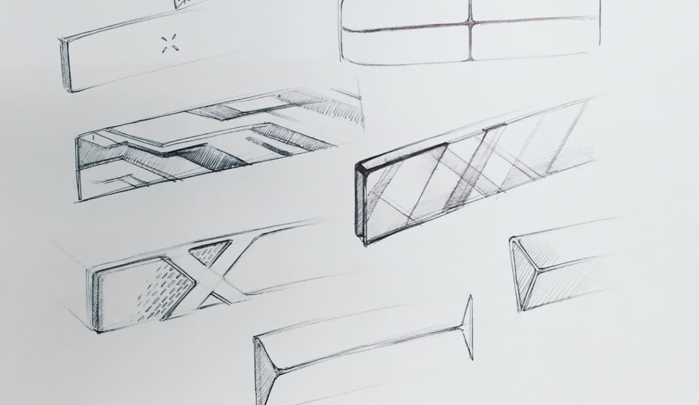

# Introduction

This project focuses on design solutions outside our digital product portfolio. An area were design could have a significant impact and a true value proposition for the early phases of our customer journey.

## The Challenge

Back in 2016, [Nutanix's hardware](https://www.webscaleworks.com/Hardware-Platforms.asp) installation process was fragmented.
Data-center admins have to track changes across three different interfaces throughout the installation process. They write down hardware information to inventory and deploy infrastructure.
It is for lack of a better term, an inefficient and error-prone process that incurred costs for the company, and affects our partners and customers' service reliability.

Victor (our data-center administrator), is explaining how the infrastructure installation process works.

## Goals

The first step was to capture the installation pain-points from our previous conversations with Admins and translate them into goals:

1. Optimize manual data-entry workflows.
2. Reduce multi-service dependencies.
3. Improve information precision for troubleshooting.

After some ideation rounds the proposed solution consisted of a two piece solution: A mobile app and a complementary hardware component.
I pitched the idea to a group of designers and three back-end engineers. This team was essential to the project's success, each one with a complementary skill that took this project from concept into a working prototype.

## Solution: Mobile app

The application goal was to be minimal, unobtrusive. The user experience and visual language remained focused to prioritize on speed and convenience.
Adding hardware to the inventory was a task our admins would perform multiple times in a day, so we wanted to make it a frictionless one. Below the interaction details of the most critical workflows for the app.

### Managing inventory

To add a block to the catalog, you just needed to scan the faceplate. All required information was encoded in an NFC sticker on the back of the bezel, removing the need to manually input block data.

> Block registered
>
> Some information here

### Registering Blocks

Once a blockappears on the list, you can select and add it to Prism or any other service that required the block information. The app was in charge of passing block data back and forward, guaranteeing data integrity in each step of the installation.

> Block registered
>
> Some information here
>
> ### Registering block
>
> [video](img/glass3.mp4)

### Datacenter Mapping

Using the smartphone position, we could determine the coordinates of the block during a registration event. The phone would help create a 3-dimensional representation of the data-center. The information was processed in-device directly, keeping the information securely within the local network's confines but allowing a data-center administrator to determine better the exact position of failing hardware.

## Solution: Smart bezel

The concept integrated a 255 color LED strip we could use to transmit status information from the hardware back to our admin and our NFC sticker placed behind the inner side of the bezel with the required hardware information to pair.

The final faceplate used a modern design language and proposed using premium materials for its construction. Once paired with the management service, it would be able to show system information through the light strip. We captured a couple of use cases for the demo that included:

- Block hardware error.
- Software operations, like updating that is taking place in a specific piece of hardware.

## A working prototype

Thanks to a clear goal and effort from the team, delivered a working prototype of the app, the bezel functionality, and an excellent pitch for our C-level executives that earned us the most creative award in that year's hackathon.

In 2018 we were nominated to the UX Design awards - IFA Consumer Electronic's in Berlin, an international competition for user-centric design solutions that utilize state-of-the-art technologies

